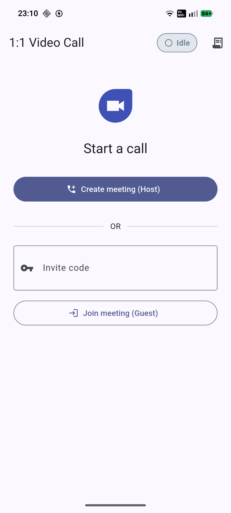
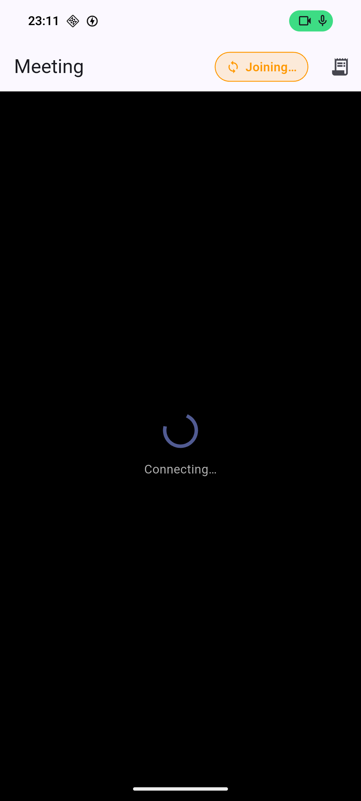
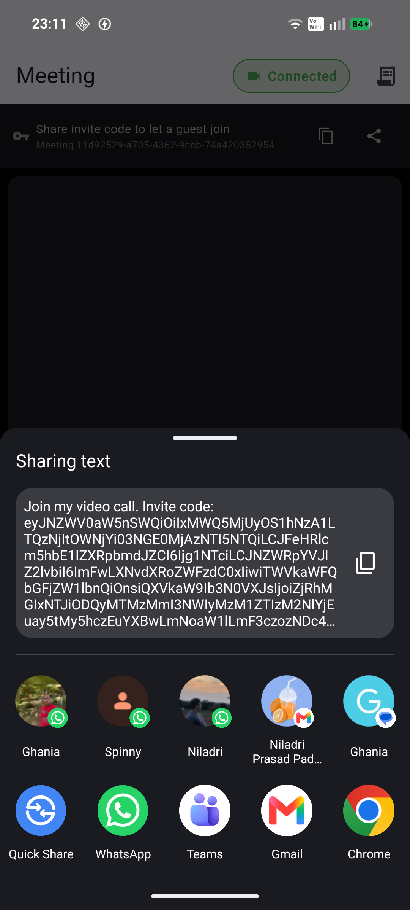
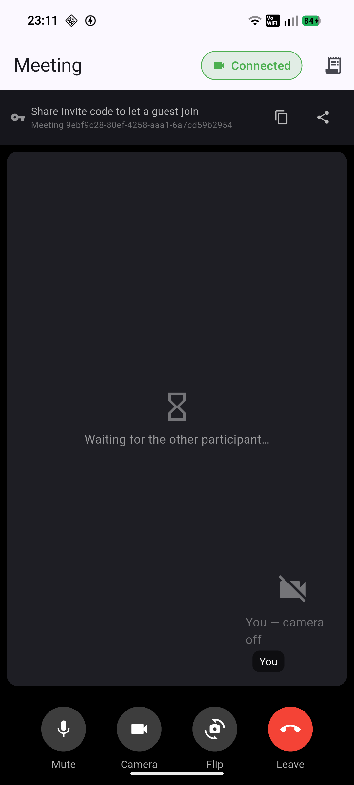
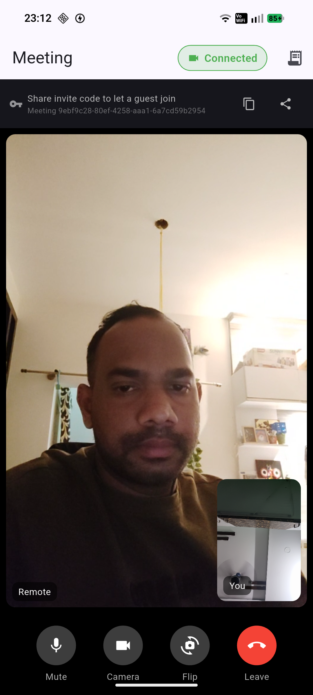

# 1:1 Real-Time Video Calling (Flutter + Amazon Chime SDK)

A Flutter, Android-first app for a **1:1 real-time video call**. One user (Host / `agent`)
creates a meeting; the other (Guest / `client`) joins with an **invite code** shared by the
host. Both see local + remote video, hear two-way audio, toggle their own mic/camera, switch
camera, and leave — with a live connection-status indicator and an append-only event log.


## Download & demo

| Deliverable | Link |
|-------------|------|
| **Signed release APK** (~90 MB; API URL + key baked in) | [`Results/app-release.apk`](Results/app-release.apk) |
| **Demo video** — 2-device end-to-end walkthrough | [`Results/Demo_Videomp4.mp4`](Results/Demo_Videomp4.mp4) |

Install it on a connected device:

```bash
adb install -r Results/app-release.apk
```

### Screenshots

_In flow order:_

<table>
  <tr>
    <td align="center"><b>1. Home — start a call</b></td>
    <td align="center"><b>2. Joining / connecting</b></td>
    <td align="center"><b>3. Share invite code (Host)</b></td>
  </tr>
  <tr>
    <td></td>
    <td></td>
    <td></td>
  </tr>
  <tr>
    <td align="center"><b>4. In call — waiting for guest</b></td>
    <td align="center"><b>5. In call — two-way video</b></td>
    <td></td>
  </tr>
  <tr>
    <td></td>
    <td></td>
    <td></td>
  </tr>
</table>

## Run

```bash
flutter pub get
dart run build_runner build --force-jit          # generates freezed/json code

flutter run \
  --dart-define=API_BASE_URL=https://assess.hipster-dev.com/api \
  --dart-define=API_KEY=qxsm2peuW5ZiMz5Nq7DS
```

Build the release APK:

```bash
flutter build apk --release \
  --dart-define=API_BASE_URL=https://assess.hipster-dev.com/api \
  --dart-define=API_KEY=qxsm2peuW5ZiMz5Nq7DS
# → build/app/outputs/flutter-apk/app-release.apk
```

Run the full flow **without the native SDK** (in-memory fake RTC — handy on an emulator or for
UI review):

```bash
flutter run --dart-define=USE_FAKE_RTC=true
```

> `> build_runner`: on Dart 3.10 pass `--force-jit` (a known SDK/build_runner interaction where
> AOT compile trips over an unrelated dependency's build hook). Dart 3.11+ does not need it.

## State management — why Bloc

The meeting lifecycle is a natural **event-driven finite state machine**
(`Idle → Joining → Connected → Disconnected`, plus `Error`), and the event log maps cleanly to a
stream of discrete transitions. `flutter_bloc` gives explicit events, immutable
self-describing states, and first-class testability (`bloc_test`) — a better fit here than
Provider/Riverpod. **All** UI is a pure function of `MeetingState`; side effects (API, Chime,
permissions) happen in the Bloc via injected use cases/ports.

## Architecture

Strict, one-directional layering — `presentation → domain → data`:

```
lib/
  core/            config (dart-define), error (typed Failures), di (get_it), utils
  features/meeting/
    domain/        entities, ports (RtcClient, MeetingRepository, PermissionService), usecases
    data/          DTOs (freezed/json), mappers, MeetingApiClient (dio),
                   MeetingRepositoryImpl, ChimeAndroidBridge, FakeRtcClient
    presentation/  MeetingBloc (+ states/events), pages, widgets
android/app/src/main/kotlin/.../chime/
    ChimeBridge.kt         MethodChannel("chime/commands") + EventChannel("chime/events")
    ChimeVideoView.kt      PlatformView wrapping Chime DefaultVideoRenderView
```

- `domain/` imports **no** Flutter/dio/platform/Chime types.
- The UI never touches `dio` or platform channels; Amazon Chime is reached only through the
  domain `RtcClient` port. Its real implementation is the native Android bridge
  (`ChimeAndroidBridge` ↔ `ChimeBridge.kt`); a `FakeRtcClient` implements the same port for
  tests and an SDK-independent demo (selected at runtime via `USE_FAKE_RTC`).
- Every backend call returns `Either<Failure, MeetingSession>`; the Bloc converts failures into
  a user-visible message **and** an event-log entry. No swallowed exceptions.
- `Connected`/`Disconnected` are driven **only** by Chime SDK callbacks — never by the HTTP
  response alone.

```
UI (widgets)  →  MeetingBloc  →  UseCases  →  MeetingRepository  →  MeetingApiClient (dio)
                      │                         RtcClient (port) →  ChimeAndroidBridge ↔ Chime SDK
                      └── event log (append-only, in state)         PermissionService
```

### Backend contract (`POST /meetings`)

Single endpoint, header `x-api-key`. Encoding defaults to **query parameters** (matches the
Postman collection) with a one-flag JSON-body fallback in `MeetingApiClient`.

| Action | Request |
|--------|---------|
| Create (Host) | `POST /meetings?type=agent` |
| Join (Guest)  | `POST /meetings?type=client&meeting_id=<id>` |
| Refresh (Host)| `POST /meetings?type=agent&meeting_id=<id>` |

Response `data.meeting` (Chime CreateMeeting) + `data.attendee` (Chime CreateAttendee, with a
**fresh** `JoinToken` per call). The raw JSON is preserved end-to-end so the native side rebuilds
`MeetingSessionConfiguration` verbatim.

> **Important backend behaviour:** only the initial **create** (`type=agent`, no id) returns the
> full `meeting.MediaPlacement` (audio/signaling/TURN URLs). Any call with a `meeting_id`
> (`type=client` or `type=agent`) returns **only** `{ "MeetingId": … }` plus a fresh attendee —
> which is not enough for the Chime SDK to connect. Since `MediaPlacement` is shared by all
> attendees of a meeting, the Host hands the full meeting object to the Guest via an **invite
> code** (`InviteCodec` = URL-safe base64 of the raw meeting JSON). On join, the Guest decodes the
> invite for the media URLs and calls the API purely to obtain its own attendee token.

## Tests

```bash
flutter analyze   # clean
flutter test      # 24 tests
```

- DTO parsing/mapping against a realistic Chime payload.
- `MeetingRepositoryImpl` with mocked `dio` (success + each error envelope).
- `MeetingBloc` state machine + event-log emission with a controllable fake `RtcClient`.
- `ControlBar` / `StatusChip` widget tests.

The native Chime bridge is validated by building the APK against the real
`software.aws.chimesdk:amazon-chime-sdk:0.25.0` and by the two-device demo below.

## Assumptions

- Two Android devices/emulators with camera + mic for the demo; stable connectivity.
- The provided backend + API key stay valid for the assessment window.
- The invite code is shared manually (Copy / native Share on the Host; paste on the Guest).
- Time-boxed assessment: a clean working vertical slice over broad, half-finished features.

## Known limitations

- **Android only** — iOS is out of scope (no official Chime Flutter SDK).
- **No reconnection** after a network drop — the app reflects/logs `Disconnected` only; no auto
  re-join.
- **No QR/deep-link** invite-code handoff (manual copy/paste/share only); the invite code is a
  long base64 string because it carries the full meeting object (backend limitation above).
- Event log is **in-memory, per session** (cleared on a new call); no persistence.
- Release APK is a fat APK (~94 MB) bundling Chime media for all ABIs; use
  `--split-per-abi` to shrink per-device.
- Camera "flip" and mic mute are applied optimistically; remote reflection depends on Chime
  SDK callbacks.

